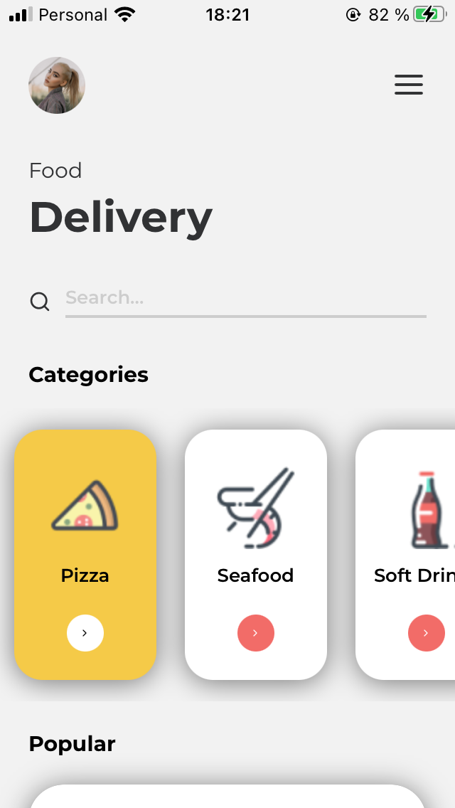
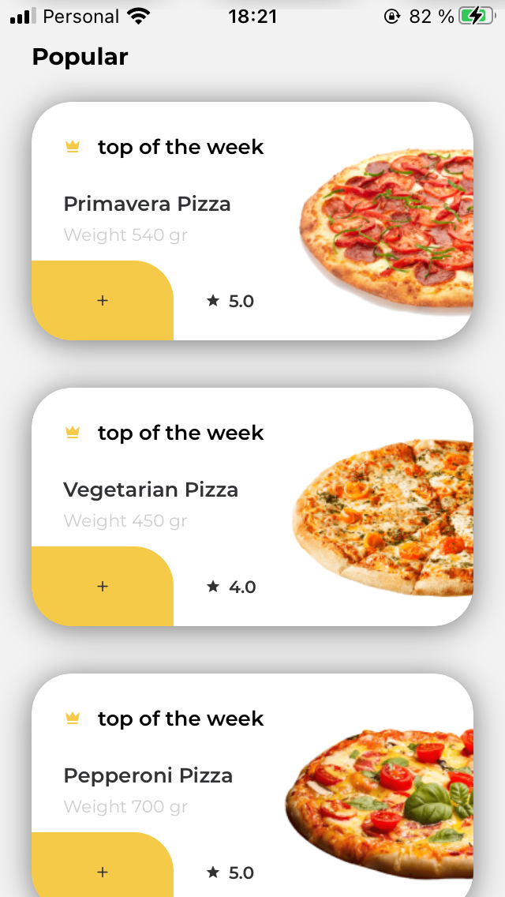
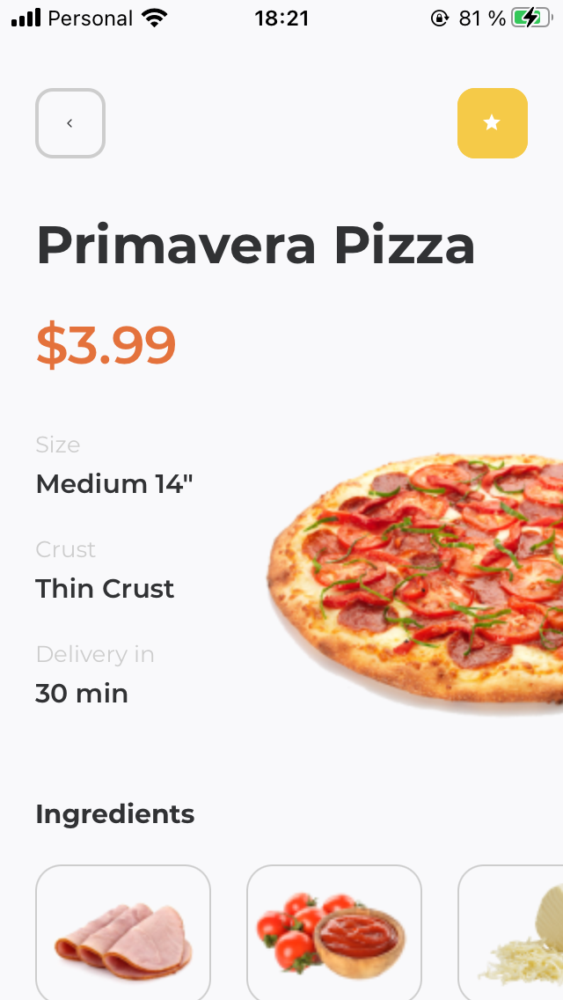
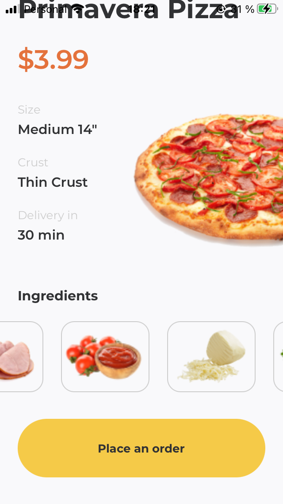

# food-app

## Español

Diseño de una app de delivery simple

- Imágen de usuario
- Barra de Búsqueda
- Sección de Categorias y Populares
- Detalle de la comida (precio, tamaño, tiempo estimado de delivery y listado de los ingredientes)

## English

Delivery Food App UI design

- User image
- Search bar
- Categories and Popular Sections
- Food Details (price, size, estimated delivery time and ingredients list)

## Screenshots

### Página Principal // Home Page

<kdb>

</kdb>

<kdb>

</kdb>

---

### Página Detalles // Details Page

<kdb>

</kdb>

<kdb>

</kdb>

---

## Fonts

- [Montserrat](https://fonts.google.com/specimen/Montserrat)
