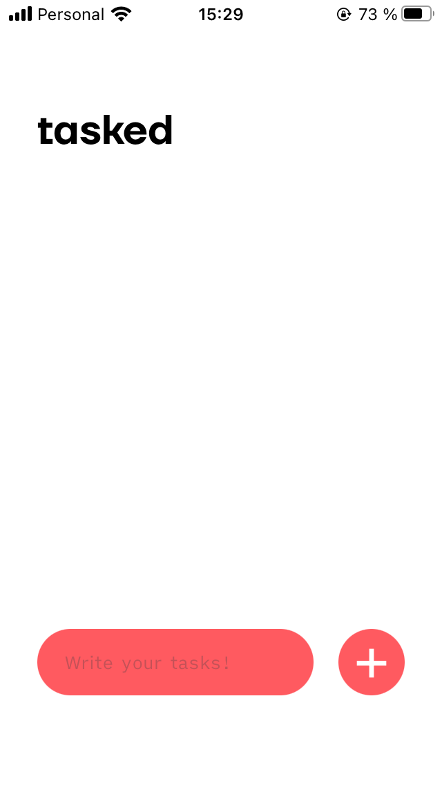
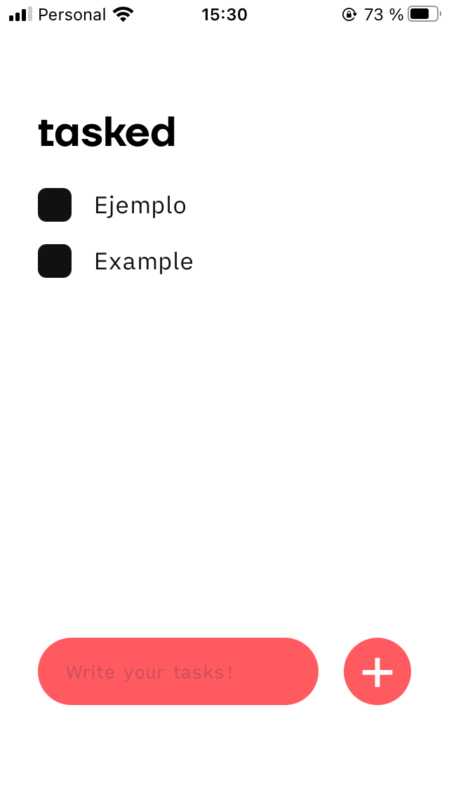
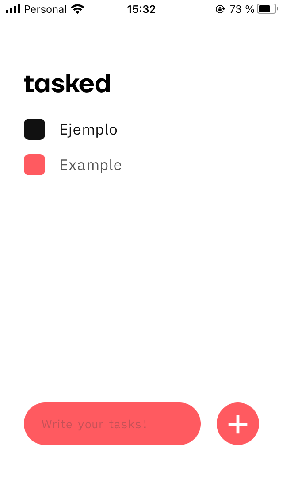

# todo-list

## Español

Un diseño simple de una aplicacion de tareas.  
Escribe la tarea que debas realizar, luego toca el boton "+" para añadirla.  
Luego toca la tarea para marcarla como realizada, tocarla nuevamente la borrara de la lista de tareas!

## English

A simple ToDo app design.  
Write a "to do" task, then press the "+" button to add it.  
Then, press the task once to mark it as completed, pressing it again will delete from the task list!

## Screenshots

### Lista Vacia // Empty List

<kbd>

</kbd>

---

### Ejemplo de tarea // Task example

<kbd>

</kbd>
  
---

### Tarea completada // Completed Task

<kbd>

</kbd>
  
## Fonts

- TT Firs Neue Bold.
- [iA Writer Quattro V](https://github.com/iaolo/iA-Fonts/tree/master/iA%20Writer%20Quattro).
